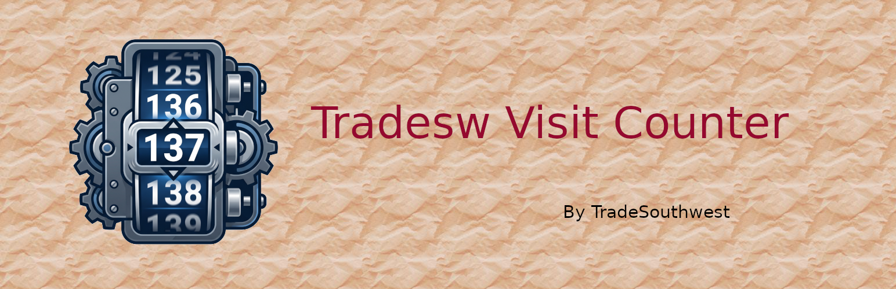

# Tradesw Visit Counter

[](https://www.gnu.org/licenses/gpl-3.0)

- Requires PHP: 7.4
- Requires CP:  1.4
- Version:      1.0
- Author:       Tradesouthwest
- Tags:         counter, posts, visits, translation-ready
- License:      GPL 3 (see LICENSE)
- Text domain:  tradesw-visit-counter
- Plugin URL:   https://github.com/tradesouthwest/post-visit-tally

## Overview

Adds Admin column to edit page of posts to show number of visits to post.

## Support
Use https://github.com/tradesouthwest/tradesw-visit-counter/issues to post your issues with this plugin.

## Change Log
See file CHANGELOG.md

## Implementation Details

Hook Selection: We use wp_head for tracking to ensure the visit is only counted when the page begins to render for a user.

Metadata Naming: The meta key is prefixed with an underscore (_warsww_post_views), which keeps it hidden from the standard "Custom Fields" metabox in the editor, preventing accidental manual edits.

Performance: For high-traffic sites, consider offloading this to a REST API endpoint or using an external database to prevent heavy update_post_meta calls on the wp_postmeta table.

Citations: This implementation follows the standard WordPress Plugin Handbook guidelines for hooks and class-based architecture.

```
warsww-visit-counter/
├── warsww-visit-counter.php   # Main Loader & Logic
└── inc/
    └── class-admin-columns.php # Admin Display Logic
```
